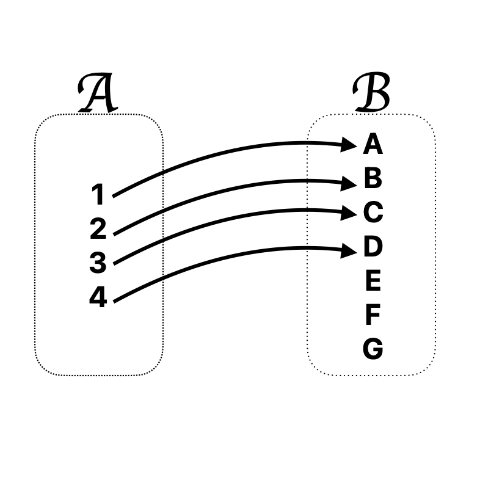
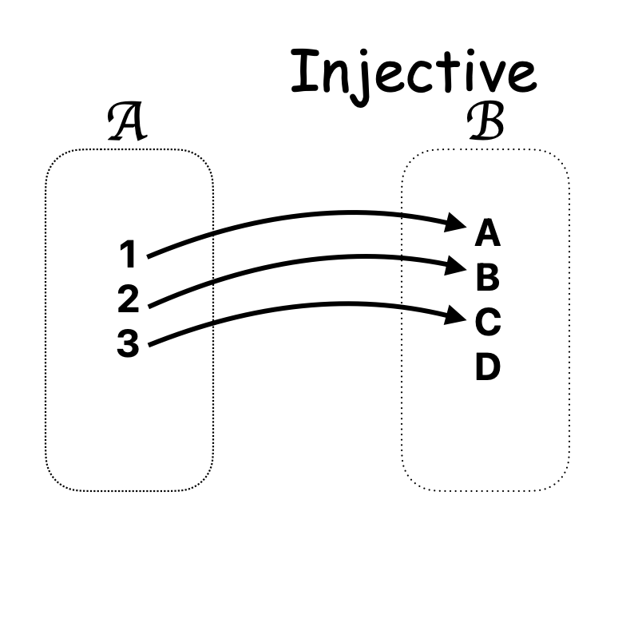
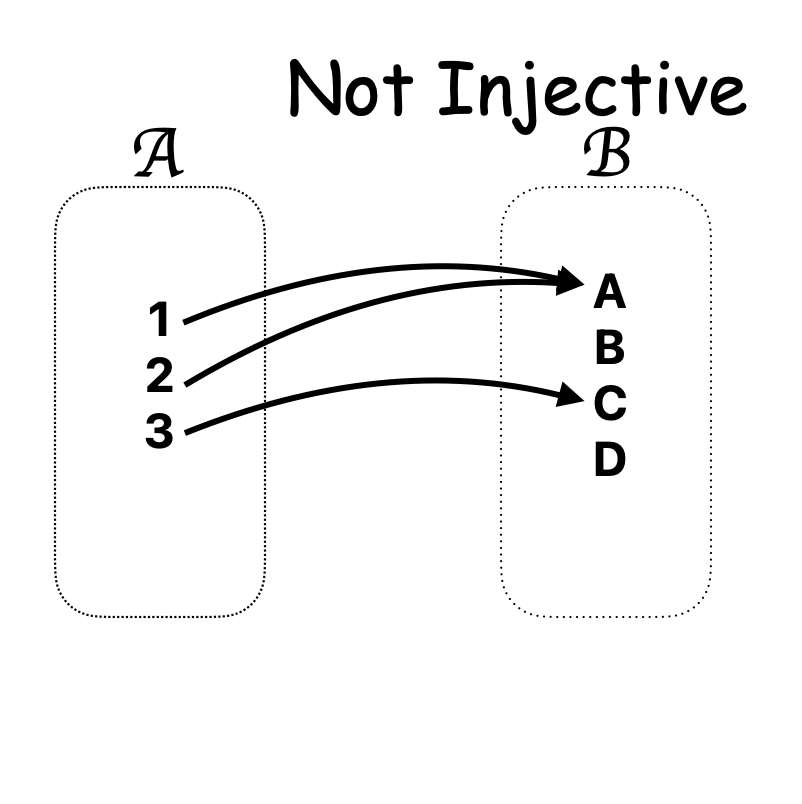
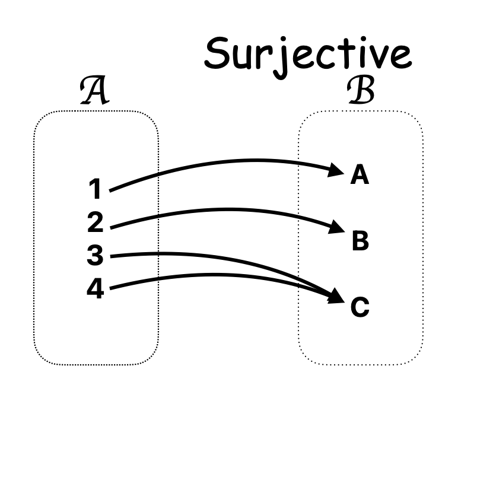
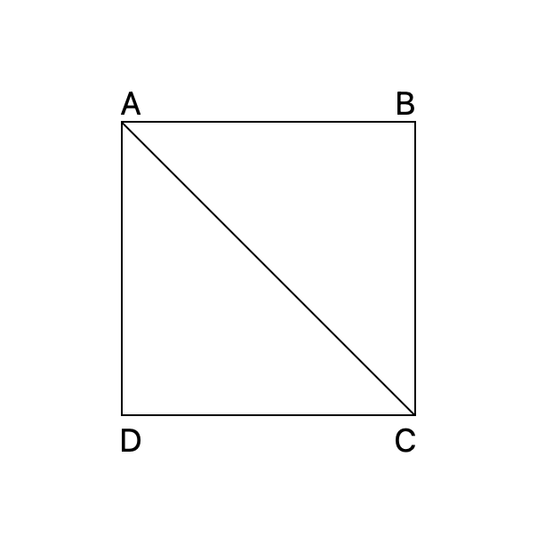

# $SET$

## ___Introduction to Sets___

Key Concepts:

- Definition: A set is a collection of distinct objects.<br>
- Notation: **{ }** <br>
- Elements: Members of a set.

Types of Sets:<br>

- Finite Set: $\{1, 2, 3, 4\}$<br>
- Infinite Set: $\{1, 2, 3, \ldots\}$ (Natural numbers)<br>
- Empty Set: **{ }** or $\varnothing$ <br>

Set Operations:<br>

- Union ( $\cup$ ): All elements in either set.<br>
- Intersection ( $\cap$ ): Common elements.<br>
- Difference ( - ): Elements in A but not in B.<br>
- Complement ($A^c$): Everything not in A.

## De Morgan's Laws

1. $(A \cup B)^c = A^c \cap B^c$
2. $(A \cap B)^c = A^c \cup B^c$

``PROOF``

1. $(A \cup B)^c = \{x \mid x \notin (A \cup B)\}$<br>
   $=(x \notin A) and (x \notin B)$<br>
   $=(x \in \overline{A}) and (x \in \overline{B})$<br>
   $=(x \in \overline{A} \cap \overline{B})$<br>
2. $(A \cap B)^c = \{x \mid x \notin (A \cap B)\}$<br>
   $=(x \in \overline{A}) and (x \in \overline{B}).$`<br>
   $=(x \notin A) and (x \notin B)$<br>
   $=(x \notin A \cup B).$<br>
   $=(x \in \overline{A \cup B})$<br>
   $= (A \cap B)^c$

## Cartesian Product

- If 'A' and 'B' are two non - empty sets, then there cartesian product is defines as <br>
  $A \times B = \{(a, b) | a \in A, b \in B\}$<br>

## Relations

- A relation $R$ between two non - empty sets X and Y is are defined as the set of ordered pairs (x, y) where x belongs to X and y belongs to Y. <br>
  i.e. $r = {(x, y) | x \in X, y \in Y}$<br>

`Example`: Let A = {1, 2, 4, 6} and B = {2, 5, 9, 6, 10, 12}.<br>
$r : (a,b) \in (A \times B) | a\,\ divisor\,\ b$.<br>
``Answer``: r = {(2, 1), (2, 2), (4, 2), (4, 4), (6, 2), (6, 6)}<br>

# *Functions*

- A function $f$ from X to Y, denoted as $f X \rightarrow Y$ a relation that maps each element to exactly on element of y.<br>
- X is the domain of $f$<br>
- Range of the function is the set $\{y \in Y |y = f(x), for\,\ some\,\ x\in X \}$.<br>
- A function from set A to Set B is rule that assign every elements of A to exactly one element of B.<br>
  So $f: x\in y$ is a function.<br>
- A is called the image of 1 and 1 is called the pre image of point A is Set A.<br>

So, image set of the function $f$ is {A,B,C} which is always a subset of range of the function ,i.e B set.<br>
<br>
x : The domain of the function.<br>
Range of the function is the set of all image of the point from x under $f$.<br>


`Q`. $g(x) = \frac{3x}{x^2-4}$<br>
`ANSWER`. domain $\mathbb{R} - \{\pm 2\}$

`Q`. $h(x) = \sqrt{4-3t}$<br>
`ANSWER`. domain $(-\infty,\frac{4}{3})$

## Classification

### 1. Injective function

A function $f$ : A $\rightarrow$ B is called injective if different point of A are mapped to different elements in B.<br>
 <br>
$f : \{{1 , 2 , 3 , 4}\} \rightarrow \{{a , b , c}\}$

### 2. Surjective function

A function from  A to B ($f$ : A $\rightarrow$ B) is called surjective on onto mapping(function) if every points in codomain set has a pre image in set A.<br>
<br>
$f$(1) = A<br>
$f$(2) = B<br>
$f$(3) = C<br>
$f$(4) = C<br>
$\hspace{.5cm}\Downarrow $<br>
Range or Image Set = {A,B,C}

### 3. Bijection mapping

A function $f:A\rightarrow B$ is called Bijection if it is both onto and one-one.<br>
i.e<br>
1. Range - Co-domain<br>
2. Every element is co-domain has exactly one pre image on domain.<br>

## Injection checking

```python
def injection_check(func, domain):
    output_value = {}
    for x in domain:
        fx = func(x)
        if fx in output_value:
            return False  # Found a duplicate output
        output_value[fx] = x 
    return True

# Define function

def f1(x):
    return x * x 

# Define the domain

element = list(range(-10, 1))
print("Is the function injective?", injection_check(f1, element))
```

##  Surjective checking
```python
def surjection_check(func, domain, codomain):
    output_value = set()
    for x in domain:
        fx = func(x)
        output_value.add(fx)  # Collect all outputs

    # Check if the codomain is a subset of the output values
    return codomain.issubset(output_value)

# Define function
def f1(x):
    return x * x 

# Define the domain and codomain
domain = list(range(-10, 1))
codomain = set(range(0, 101))  # Example codomain (0 to 100)

print("Is the function surjective?", surjection_check(f1, domain, codomain))   
```

### 1. Commutative Law

Union: $A \cup B = B \cup A$<br>
Intersection: $ A \cap B = B \cap A$<br>

### 2. Associative Law

Union: $(A \cup B) \cup C = A \cup (B \cup C)$<br>
Intersection:$(A \cap B) \cap C = A \cap (B \cap C)$

### 3. Distributive Law

Intersection over Union:$A \cap (B \cup C) = (A \cap B) \cup (A \cap C)$<br>
Union over Intersection:$A \cup (B \cap C) = (A \cup B) \cap (A \cup C)$<br>

### 4. Identity Law

$A \cup \phi = A$<br>
$A \cap U = A$

### 5.

$A \cup U = U$<br>
$A \cap \phi = \phi$

### 6. Idempotent Law

$A \cup A = A$<br>
$A \cap A = A$

### 7. Complement Law

$(A^c)^c = A$<br>
$A \cup A^c = U$<br>
$A \cap A^c = \phi$

`PROVE THAT`: $A \cap (B \cup C \cap D) = (A \cap B) \cup (A \cap C\cap D)$<br>
= $A \cap (B \cup C \cap D)$ [Distributive]<br>
= $(A \cap B) \cup (A \cap (C \cap D))$<br>
=$(A \cap B) \cup (A \cap C\cap D)$

`Q`. PROVE THAT : $(A - B) \cup (A \cap B) = A$<br>

= $(A \cap B^c) \cup (A \cap B)$<br>
= $A \cap (B \cup B^c)$ [Distributive]<br>
= $A \cap U$ <br>
= A

### Type of Relation :-

#### 1. Reflective Relation

A relation $R$ on A is called reflection if $(a,a)\in R$ for all a $\in$ A.<br>

`Example`: The greater than or equal to $(\geq)$ relation.<br>

`Q`.A = {1,2,3} <br>
R = {(1,1) ,(2,2) ,(1,2) ,(2,1)}  $\Rightarrow$ not a reflective <br>
R = {(1,1) ,(2,2) ,(1,2) ,(2,1) ,(3,3)}$\Rightarrow$ a reflective

#### 2. Symmetric Relation

A relation $R$ is said to be Symmetric if $(a,b)\in R \Rightarrow \ (b,a)\in R$<br>
`Example`: <br>
Let A = {1,2,3}<br>
The relation R = {(1,2),(2,1),(2,3),(3,2)} $\Rightarrow$ Symmetric Relation

#### 3. Antisymmetric Relation

A relation $R$ is said to be Antisymmetric if $(a,b)\in R \ and \ (b,a)\in \R\ together\ implies\ a = b.$<br>
`Example`: <br>
Let A = {1,2,3}<br>
The relation R = {(1,2),(2,2),(3,3),(1,2)}

#### 4. Transivitive Relation

A relation $R$ on A is transivitive if $(a,b) \in R \ and \ (b,c) \in R \ then \ (a,c) \in R.$<br>
`Example`:<br>
A = {1,2,3}<br>
R = {(1,2),(2,3),(1,3)}

`Q`. V = {A,B,C,D}<br>
<br>
`ANSWER`:{(1, 1), (1, 2), (1, 3), (2, 1), (3, 3), (3, 1)}.

#### 5. Equivalent Relation

If a relation is symmetric , transitive and reflective , then it is called equivalent relation .<br>
A = {1,2,3,4}<br>
R = {(1,1),(1,2),(1,3),(2,1),(3,3),(3,1)}

## Partial and Relation

A relation which is reflective , antisymmetric and transitive <br>

`Q`. A = {1,2,4,8}<br>
R = $\{(a,b)\in A \times A | a \ is \ divisor \ of \ b\}$<br>

## Total order relation

A partial order relation is called a total order if every pair of elements are comparable.

`EXAMPLE`:<br>
A = {1,2,3}<br>
R = {(1,1),(2,2),(3,3),(1,2),(2,3),(1,3)}
