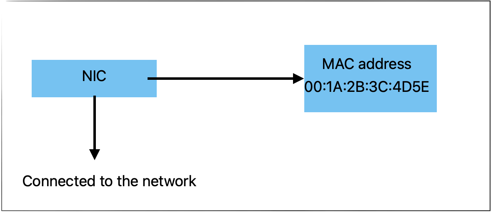

# Number System Conversion

Four common number system are:<br>
- 1. Decimal(base 10)
- 2. Binary(base 2)
- 3. Octal(base 8)
- 4. Hexa-decimal(base 16)

Except of these,there are number system with base 3 and 4 but they are not important.<br>
Decimal to other base conversion.<br>

1. Decimal to Binary<br>
bin(n): convery decimal into binary.<br>
Example : bin(10) # '0b1010'

2. Decimal to Octal<br>
Oct(n)<br>
Example : print(oct(10))<br>
'0o12'

3. Decimal to Hexa-decimal<br>
hex(10)<br>
Example : print(Hex(10)) # '0xa'

Other base to decimal<br>

1. Binary to Decimal<br>
Print(int(Binary_string,2))<br>
Example : print(int('011',2)) # 3 <br>

### Number System converstion for floating point numbers<br>
#### Decimal to other bases<br>
- Decimal to binary<br>

```python
def float_to_binary(num,precision):
    integer_part = bin(int(num))[2:]
    fraction_part = num-int(num)
    binary_fraction = []
    while fraction_part != 0 and len(binary_fraction) < precision:
        fraction_part *= 2
        bit = int(fraction_part)
        binary_fraction.append(str(bit))
        fraction_part -= bit
    return f"{integer_part}.{''.join(map(str, binary_fraction))}"
print(float_to_binary(10.625, 3))
```
Example :<br>
n = 10.625<br>
$0.625 \times 2 = 1.250\\
0.250 \times 2 = 0.500\\
0.500 \times 2 = 1.000$<br>


- Binary to Decimal
```python
def bin_to_decimal(binary_str):
    integer_part, fraction_part = binary_str.split('.')
    decimal_value = int(integer_part, 2)
    for i, digit in enumerate(fraction_part):
        decimal_value += int(digit) * (2 ** -(i + 1))
    return decimal_value
```
`Q. What will be the the output?`<br>
```python
import itertools
print(itertools.product([0,1],[0,1]))
```
Answer :<br>
"<itertools.product object at 0x117d6a440>"<br>
It's show hexa- decimal (integer) value,that is basically address of thismethod.<br>

### What is a DataFrame?
A DataFrame is a two-dimensional, table-like data structure in Pandas, similar to a spreadsheet or SQL table. It consists of rows and columns and allows efficient data manipulation and analysis.
A DataFrame has the following key components:
- Index: Unique labels for rows (default is numerical starting from 0).
- Columns: Labeled names for different features or attributes.
- Data: The actual values stored in the DataFrame.

#### Creating DataFrames in Pandas
- Creating a DataFrame from a Dictionary
```python

import pandas as pd
data = {
"CustomerID" : [ 1 , 2 , 3 ] ,
"Country" : [ "USA" , "India" , "Canada" ] ,
"State " : [ "Georgia" , "Karnataka", "Ontario" ] ,
"City" : [ "Atlanta" , "Bangalore" , "Toronto" ] ,
"Zip Code" : [ "30332" , "560001" , "M4B 1B3" ]
}
df = pd.DataFrame ( data )
print ( df )
```

#### Creating a DataFrame from a List of Lists
```python
import pandas as pd
data = [ [ 1 , "USA" , "Georgia" , "Atlanta" , "30332" ] ,
[ 2 , "India" , "Karnataka" , "Bangalore" , "560001" ] ,
[ 3 , "Canada" , "Ontario" , "Toronto" , "M4B 1B3" ] ]
columns = [ "CustomerID", "Country" , "State" , "City" , "Zip Code" ]
df = pd.DataFrame ( data , columns=columns )
print ( df )
```

#### Creating a DataFrame from a CSV File
```python
df = pd.readcsv( "CustomerList.csv" )
print ( df )
```

#### Creating a DataFrame from an Excel File
```python
df = pd.readexcel( "CustomerList.xlsx" )
print ( df )
```

#### Creating a DataFrame from a NumPy Array
```python
import pandas as pd
import numpy as np
array = np.array([[ 1 ,"USA" ,"Atlanta" ] , [ 2 , "India" , "Bangalore"] , [ 3 ,"Canada" ,"Toronto"]])
df = pd.DataFrame(array,columns=["CustomerID","Country","City"] )
print ( df )
```

#### Creating an Empty DataFrame

```python
import pandas as pd
df = pd.DataFrame (columns=["CustomerID","Country","State","City","Zip Code"] )
print(df)
```

### Common DataFrame Methods
- Displaying Data
```python
print(df.head()) # Shows the first 5 rows
print(df.tail(3)) # Shows the last 3 rows
print(df.info()) # Displays column details and data types
print(df.describe()) # Shows statistical summary of numerical columns
```

- Accessing Specific Data
```python
print(df["Country"]) # Accessesa single column
print(df[["Country","State"]]) # Accesses multiple columns
print(df.loc[1]) # Accesses a row by index
print(df.iloc[0:2]) # Accesses first two rows using position−based indexing
```

- Filtering Data Using Conditions
```python
usa customers = df[df["Country"] == "USA"] #Filters rows where Country is USA
georgia_customers = df[(df["Country"] == "USA" ) & (df["State"] == "Georgia") ]
print (georgia_customers )
```

- Adding New Columns
```python
df["Membership"] = ["Gold","Silver","Bronze"] # Adds a new column
print(df)
```

- Modifying Values
``` python
df.at[1,"City"] = "Delhi" # Updates a specific value
print ( df )
```

- Deleting Columns and Rows
```python
df.drop(columns=["Zip Code"] , in place = True)# Deletes a column
df.drop (index = 2, in place=True ) # Deletes a row
print ( df )
```

- Sorting Data
```python
sorted_df = df.sort_values( by="State" ) # Sorts by the ’State’ column
print(sorted_df)
```

- Grouping Data
```python
grouped_df = df.groupby("Country").count() # Groups by country and count sentrie
print ( grouped_df )
```

### MAC Address<br>
A media access control address (MAC) is a unique identifier assigned to a Network interface card (NIC) of a device.The MAc address is store in NIC's RAM.MAC addresses are used in Ethernet,Router and other network technologies to facilitated device identification and communication at the data-link layer of open system interconnection model(OSI) model.

<br>
```python
import uuid
print(hex(uuid.getnode()))
```
Output:<br>
0x9287003f2f7a<br>

### Structure of MAC address
A MAC address is a 6 byte Hexadecimal number typically represented in one of the following form.<br>
- Colon-separated : 00:1A:2B:3C:4D:5E
- Hyphen-separated :00-1A-2B-3C-4D-5E
- Dot-separated :001A.2B3C.4D5E
6 byte = 6 * 8 = 48<br>

`Q`.Write p Python code to convert the following binary string into hexa-decimnal string.<br>
1000 1100 1111<br>

```python
x = int("100011001111",2)
print(x)

```
Output:<br>
2255<br>

