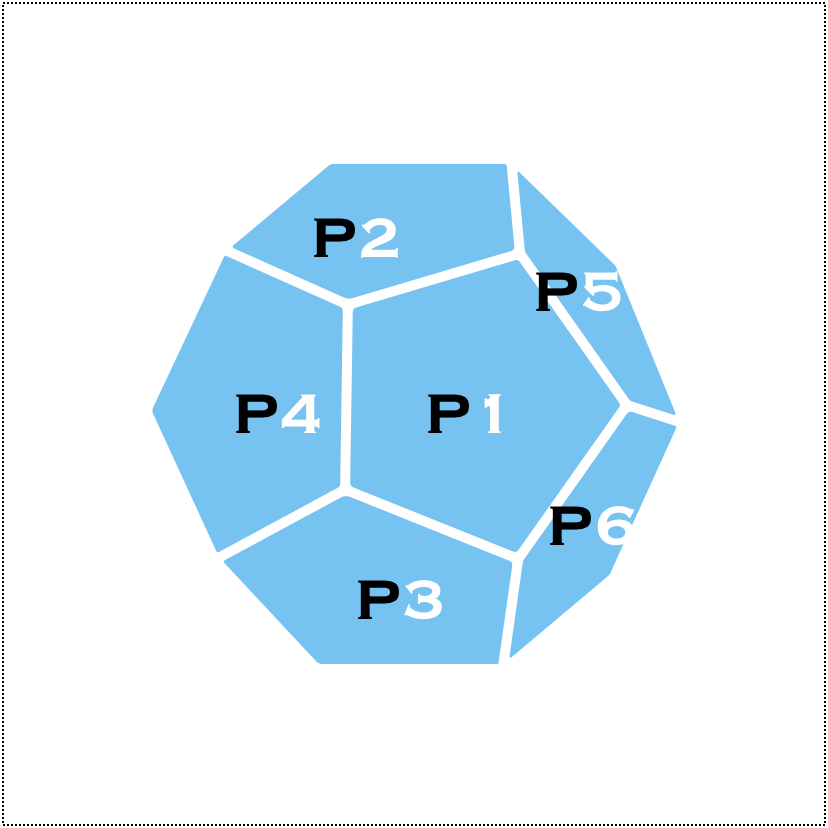
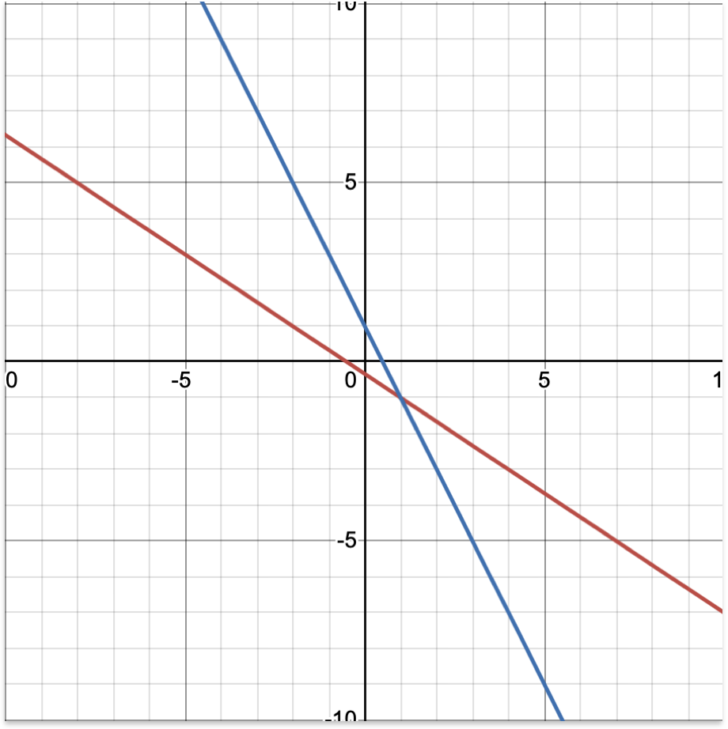
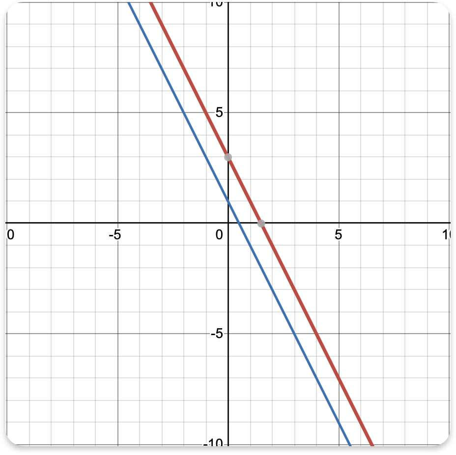
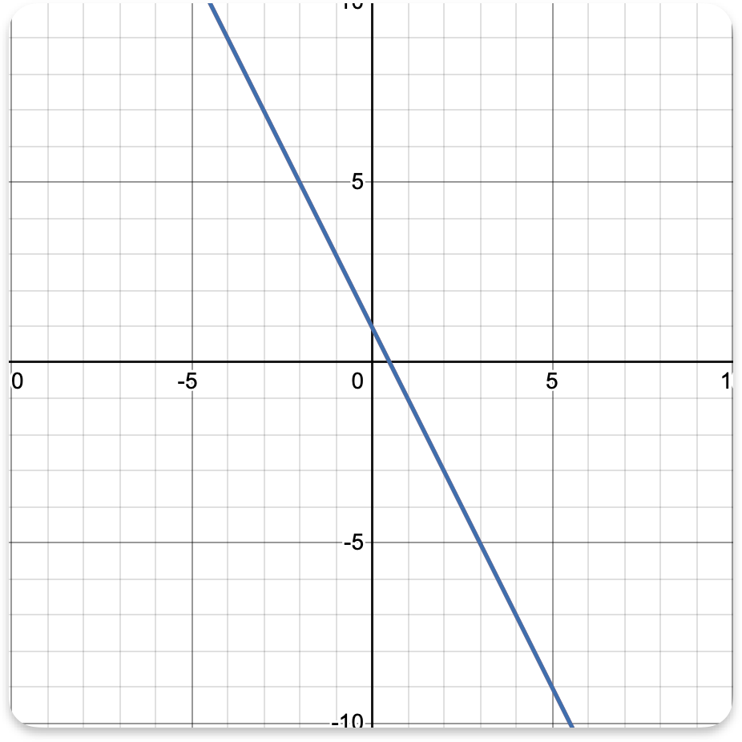

# Elements of discrete probability

`Random experiment` :<br>
A random experiment is any process that has uncertain outcome.<br>
Tossing of a coin : {H,T} <br>
Rolling of dice - {1,2,3,4,5,6}<br>

<b>`Outcomes`</b>: Each possible result of a random experiment is called outcome.<br>
`Sample space` : Set of all outcomes of a random experiment.<br>
`Event` : any subset of a sample space.<br>
$C_1 = \{H,T\} \\
C_2 = \{H,T\} \\
C_3 = \{H,T\}$<br>
$C_1 \times C_2 \times C_3 = \{HHH,HHT,HTH,HTT,THH,THT,TTH,TTT\} -- \text{Sample space}$<br>
{HHH,HTH,THH} = only two heads are there<br>
$\binom{8}{0} + \binom{8}{1} + \binom{8}{2} + \dots + \binom{8}{8}$<br>

$$(x+y)^n = \sum_{k=0}^n {^nC_r} x^k y^{n-k} $$

----
## Probability Measurement
A probability measurement is a function P : {set of all elements}->[0,1] that maps any events to a number between 0 to 1 and has the following properties,<br>
i) P(s) = 1<br>
ii) P holds the countable additive i.e if $A_1,A_2,\dots,A_n $ are mutually disjoint event then $P(A_1,A_2,\dots,A_n) = P(A_1)+P(A_2)+P(A_3) + \dots $<br>
$Q = \{\frac{m}{n} , gcd (m,n) = 1 , n = m , m = 1,\dots\}$<br>
$Q^c$ = uncountable infinite<br>

## Probability Measurement
A PM is a function P = {set of all events} --> [0,1] such that P(s) = 1 [Probability of whole sample space is 1] and if $A_1,A_2,\dots,A_n$ are countable mutual disjoint events then, $P(A_1 \cup A_2 \cup A_3\dots) = P(A_1)+P(A_2)\dots$<br>

### Theorms based on this definition
Let A and B are two events the $P(A\cup B) = P(A)+P(B)\dots$ if A and B disjoints . And<br>
i. A and B are disjointed<br>
ii. $P(\phi) = 0$<br>
iii.$P(A^c)=i - P(A)$<br>

`Proof`:<br>
P(s) = 1<br>
$P(S \cup \phi) = 1 \hspace{1cm} [s \cup \phi = s]$<br>
$P(S) + P(\phi) = 1 \hspace{1cm} [s \cap \phi = s]$<br>
$1 + P(\phi) = 1 \hspace{1cm} P(S \cup \phi) = P(s) + P(\phi)$<br>
$P(\phi) = 0$

Proof 2<br>
P(s) = 1<br>
$P(A \cup A^c) = 1$<br>
$P(A) + P(A^c) = 1$<br>
$P(A^c) = 1 - P(A)$<br>

### Monotonicity
If $A \subseteq B $ then P(A) $\le$ P(B)<br>
$B = A \cup (B-A)$<br>
$P(B) = P(A)+P(B-A)$<br>
$P(B) \ge P(A)$<br>

Q. A football match will take place between Real Madrid CF and FC Barcelora .A sport analysis has forcast that Madrid has 40 % winning chance and Barcrlona has 50% winning chance what is probability that a draw occur<br>
Answer : <br>
P(M) = 40%<br>
P(B) = 50% <br>
P(d) = ?<br>
$M \cup B \cup d = S $<br>
$P(M \cup B \cup d) = 1$<br>
$P(M)+P(B)+P(d) = 1$<br>
0.4+0.5+P(d) = 1<br>
p(d) = 0.1<br>

### Classification probability or Laplacian probability
Laplacian Random experiment:<br>
A LRE is an experiment where every possible outcome has the same probability<br>
Example: Tossing of coin(Fair coin)<br>
Rolling of 6 face dice<br>
### Theorem:
1. The sample space is finite,$|S| = |{S_1,S_2,\dots,S_n}| = n< \infin $<br>
2. The probability of each outcome is 1/n where n = |S|.<br>
3. The probability of any event $ E \subseteq
 is \frac{|E|}{|s|}$<br>

`Q`. Suppose, the sample space is infinite i.e there are infinite many outcome in the sample space say ${S_1,S_2,\dots,S_n}$ <br>
Now by definition of probability measure <br>
Answer : <br>
$P({S_1,S_2,\dots,S_n}) = 1\\
\Rightarrow P({S_1})+P({S_2})+P({S_3})\dots = 1 $<br>
Since every outcome has same probability <br>
Assume $P(S_j) = C $ for all j.<br>
$C_1 + C_2 + \dots \infin \neq 1 $(not possible)<br>
So, the sample space is finite.

## Monotonicity
If $A \subseteq B$ then $P(A) \le P(B)$<br>
$B = A \cup (B - A)$<br>
$P(B) = P(A) + P(B-A)$<br>
$P(B) \geq P(A)$


## Condition Probability
For two events A and B where P(B) > 0 , the conditional probability of A given B is defined as,<br>
$P(\frac {A}{B}) = \frac {P(A \cap B)}{P(B)} $<br>
$P(\frac {A}{B}) \Rightarrow $ Probability of A when there is a condition that B has already happen } A is given B.<br>
$P(A \cap B)\Rightarrow$ is the joint probability of occuring A and B together.<br>
P(B) is the probability of event B.<br>

|Temperature |Frequency| Rain - frequency|
-------------|---------|--------------------|
|51 - 60(in F)| 4 |1|
|61 - 70| 12 |5|
|71 - 80| 13 |10|
|81 - 90| 20 |8|
|91 - 100| 1 |1|
|Total| 50 | 25 |

B = {it rains}<br>
$P = \{51 <= T <= 60|B\} = ? $<br>
$P(\frac{T}{B}) =\frac {P(T \cap B)}{P(B)}$<br>
$P(B) = \frac{25}{50}$<br>
${P(T \cap B)} = \frac{1}{50}$<br>
$P (\frac {T}{B}) = \frac {\frac {1}{50}}{\frac {25}{50}}$<br>
For condition probability ,<br>
we know<br>
$P(A \cap B ) = \frac {P(A \cap B)}{P(B)}$<br>
$\Rightarrow P(A \cap B ) = P(B)P(A|B) \rightarrow 1$<br>
Similary,<br>
$P(B | A ) = \frac {P(B \cap A)}{P(A)} $<br>
$\Rightarrow P(A \cap B ) = P(A)P(B|A)$<br>
So, $P(A \cap B ) = P(A)P(B|A) = P(B)P(A|B)$ it is call multiplication rule<br>

## The law of Total Probability
Let , $A_1,A_2,\dots $ be a partition of a sample space s. Let B be an event , then <br>

$$ P(B)=\sum_{n=1}^\infin P(A_n \cap B) = \sum_{n=1}^\infin P(B|A_n)P(A_n) $$

`Proof`:<br>


$U = P_1 \cup P_2 \cup P_3 \cup P_4 \cup P_5 \dots \cup P_6 $<br>
Where, <br>
$P_i \cap P_j = \phi $ (if i $\neq$ j)<br>
as $ P_1,P_2, \dots P_6 $ is partition of U.<br>

Since $ S = A_1 \cup A_2 \cup A_3 \cup \dots $<br>
$B \cap S = (B \cap A_1) \cup (B \cap A_2) \cup(B \cap A_3) \cup \dots$<br>
$\Rightarrow P(B \cap S) = P(B \cap A_1) + (B \cap A_2) + \dots+ (B \cap A_n)$ <br>
$$ P(B)=\sum_{n=1}^\infin P(B|A_n)P(A_n)$$
(using multiplication rule) <br>
Hence proved..<br>

## Bayer theorem:
Let A and B are events with positive probability (i.e P(A) > 0, P(B) > 0)<br>
then ,<br>
$$ P(A|B) = \frac{P(B|A)}{P(B)} , P(B|A) = \frac{P(A|B)}{P(A)}$$
`Proof`:<br>
From multiplication rule we know<br>
$P(A \cap B ) = P(B)P(A|B)$<br>
$P(A \cap B ) = P(A)P(B|A)$<br>
$P(A \cap B ) = P(A \cap B )$<br>
$P(B)P(A|B) = P(A)P(B|A)$<br>
$P(A|B) = \frac{P(A) P(B)}{P(B)}$ [prove]<br>

## Computational algorithm in liner algebra
### Definition of liner equation in two variables
A liner equation of the variable a_1 and a_2 is any equation that can be represents in the form ax_1 + bx_2 = c where $a,b,c \in R$. The solution of the equation ax_1 + bx_2 = c are all ordered pairs $(\not x,\not y)$ that satisfy the equation i.e<br>
if $(\not x,\not y)$ is a solution of $ax_1 + bx_2 = c \Rightarrow a\not x_1 + b\not x_2 = c $<br>
#### Liner equation in n variables:<br>
$a_1x_1 + a_2x_2 + a_3x_3 \dots + a_nx_n = b_1 $ where $ a_1x_1,a_2x_2,a_3x_3 \dots, a_nx_n \in R $<br>
#### System of liner equation <br>
More than one equation are present in a system of equation <br>
$2x_1 + 3x_2 = -1$<br>
$6x_1 + 3x_2 = 3$<br>

$$
\begin{vmatrix}
2 & 3 \\
6 & 3
\end{vmatrix}
\begin{vmatrix}
x_1 \\
x_2
\end{vmatrix}
=\begin{vmatrix}
-1 \\
3
\end{vmatrix}
$$
$$
\begin{vmatrix}
2 & 3 \\
6 & 3
\end{vmatrix}
= 6- 18 = -12 \neq 0
$$
unique solution, System constraint


$2x_1 + x_2 = 3$<br>
$6x_1 + 3x_2 = 3$<br>

$$
\begin{vmatrix}
2 & 1\\
6 & 3
\end{vmatrix}
= 0
$$
no solution, incomistrt


$2x_1 + x_2 = 1$<br>
$6x_1 + 3x_2 = 3$<br>

$$
\begin{vmatrix}
2 & 1 \\
6 & 3
\end{vmatrix}
= 0
$$
unique solution, System constraint



#### Solving small liner equation system with Gaussian Elementary Method
Suppose a system,<br>
$ a_{11}x_1+a_{12}x_2+a_{13}x_3 \dots+ a_{1n}x_n = p_1$<br>
$ a_{21}x_1+a_{22}x_2+a_{23}x_3 \dots+ a_{2n}x_n = p_2$<br>
$\dots$
$ a_{n1}x_1+a_{n2}x_2+a_{n3}x_3 \dots+ a_{nn}x_n = p_n$<br>
$$ \Downarrow \text{matrix form is} \\
\begin{vmatrix}
a_{11} & a_{12} & a_{13} &\dots & a_{1n}  \\
a_{21} & a_{22} & a_{23} &\dots & a_{2n} \\
\vdots & \vdots & \vdots & & \vdots\\
a_{n1} & a_{n2} & a_{n3} &\dots & a_{nn} \\
\end{vmatrix}
\begin{vmatrix}
n_1 \\
n_2 \\
\vdots\\
n_n
\end{vmatrix}
=\begin{vmatrix}
P_1 \\
P_2 \\
\vdots \\
P_n
\end{vmatrix} \\
\downarrow \text{Augmented matrix X}\\
\begin{vmatrix}
a_{11} & a_{12} & a_{13} &\dots & a_{1n}  \\
a_{21} & a_{22} & a_{23} &\dots & a_{2n} \\
\vdots & \vdots & \vdots & & \vdots\\
a_{n1} & a_{n2} & a_{n3} &\dots & a_{nn} \\
\end{vmatrix}
\begin{vmatrix}
P_1 \\
P_2 \\
\vdots \\
P_n
\end{vmatrix}
$$

## Pivot (Deading coefficient):
For each row of a matrix , if the row is non - zero then the first non-zero element of the row is called the pivot of the row.<br>

$$
\begin{vmatrix}
2 & 3 & 0 \\
0 & 1 & 2 \\
0 & 5 & 4
\end{vmatrix}
\begin{vmatrix}
\rightarrow \text{2 is the pivot of rows} \\
\rightarrow \text{1 is the pivot of rows} \\
\rightarrow \text{5 is the pivot of rows} \\
\end{vmatrix}
$$
Row - reduced echelon form of a matrix.<br>
A matrix is in PREF if the following satisfy<br>
1. Any zero rows must br placed at the bottom<br>
2. the pivot of each non-zero row is a 1 and is to the right at the pivot of previous row.<br>
3. Each column containing 1 as pivot has zeros in all other entice.<br>

`Q`. Solving a $3\times 3$ liner system using Gaussian Elimination Process<br>
$ 2x_1 - 6x_2 + 6x_3 = -8 \\
2x_1 + 3x_2 - x_3 = 15 \\
4x_1 - 3x_2 - x_3 = 19 $

Answer : <br>
$$
\begin{bmatrix}
2 & -6 & 6 &|-8\\
2 & 3 & -1 &|15\\
4 & -3 & -1 &|19
\end{bmatrix}
\xrightarrow{\frac{1}{2}row1}
\begin{vmatrix}
1 & -3 & 3 \\
2 & 3 & -1 \\
4 & -3 & -1
\end{vmatrix}
\begin{bmatrix}
-4 \\
15 \\
19
\end{bmatrix}
\xrightarrow [row2 - 2 \times row1]{row3 - 4 \times row1}
\begin{vmatrix}
1 & -3 & 3 \\
0 & 9 & -7 \\
0 & 9 & -13
\end{vmatrix}
\begin{bmatrix}
-4 \\
23 \\
35
\end{bmatrix}
\xrightarrow {\frac{1}{9} row2}
\begin{vmatrix}
1 & -3 & 3 \\
0 & 1 & \frac{-7}{9} \\
0 & 9 & -13
\end{vmatrix}
\begin{bmatrix}
-4 \\ \frac{23}{9} \\ 35
\end{bmatrix}
\xrightarrow [row1 + 3 \times row2]{row3 - 9 \times row2}
\begin{vmatrix}
1 & 0 & \frac{2}{3} \\
0 & 1 & \frac{-7}{9} \\
0 & 0 & -6
\end{vmatrix}
\begin{bmatrix}
\frac{11}{3} \\ \frac{28}{9} \\ 12
\end{bmatrix}
\xrightarrow {\frac{row3}{-6}}
\begin{vmatrix}
1 & 0 & \frac{2}{3} \\
0 & 1 & \frac{-7}{9} \\
0 & 0 & 1
\end{vmatrix}
\begin{bmatrix}
\frac{11}{3} \\ \frac{23}{9} \\ -2
\end{bmatrix}
$$

`Q`.Solve the following system of equations.<br>
$ x+y+z = 6 \\
2x-y+z=3 \\
x+2y-z=2 $<br>
Answer:<br>
Let's solve the system using Gaussian elimination:

Given:
$$
\begin{cases}
x + y + z = 6 \\
2x - y + z = 3 \\
x + 2y - z = 2
\end{cases}
$$

Write the augmented matrix:
$$
\begin{bmatrix}
1 & 1 & 1 &| 6 \\
2 & -1 & 1 &| 3 \\
1 & 2 & -1 &| 2
\end{bmatrix}
$$

Step 1: Eliminate $x$ from rows 2 and 3.

Row2 = Row2 - 2×Row1:
$$
[2 \ \ -1\ \ 1\ |3] - 2\times[1\ \ 1\ \ 1\ |6] = [0\ \ -3\ \ -1\ |-9]
$$

Row3 = Row3 - Row1:
$$
[1\ 2\ -1\ |2] - [1\ 1\ 1\ |6] = [0\ 1\ -2\ |-4]
$$

New matrix:
$$
\begin{bmatrix}
1 & 1 & 1 &| 6 \\
0 & -3 & -1 &| -9 \\
0 & 1 & -2 &| -4
\end{bmatrix}
$$

Step 2: Eliminate $y$ from row 3.

Row3 = Row3 + (1/3)×Row2:
Multiply Row2 by $-\frac{1}{3}$ and add to Row3:
$$
[0\ 1\ -2\ |-4] + \frac{1}{3}[0\ -3\ -1\ |-9] = [0\ 0\ -\frac{7}{3}\ |-7]
$$

So, Row3 becomes:
$$
[0\ 0\ -\frac{7}{3}\ |-7]
$$

Multiply both sides by 3 to clear denominators:
$$
[0\ 0\ -7\ |-21]
$$

Now the matrix is:
$$
\begin{bmatrix}
1 & 1 & 1 &| 6 \\
0 & -3 & -1 &| -9 \\
0 & 0 & -7 &| -21
\end{bmatrix}
$$

Step 3: Back substitution.

From Row3:
$$
-7z = -21 \implies z = 3
$$

From Row2:
$$
-3y - 1z = -9 \implies -3y - 3 = -9 \implies -3y = -6 \implies y = 2
$$

From Row1:
$$
x + y + z = 6 \implies x + 2 + 3 = 6 \implies x = 1
$$

**Solution:**
$$
x = 1,\quad y = 2,\quad z = 3
$$

`Q`.Solving linear system using Numpy<br>
Suppose we have the system ,<br>
$$
\begin{bmatrix}
2 & -6 & 6 \\
2 & 3 & -1 \\
4 & -3 & -1
\end{bmatrix}
\begin{vmatrix}
-8 \\ 15 \\ 19
\end{vmatrix}
$$
- Defining the system using Numpy
- Create Matrices
- A = numpy array([[2,-6,6],[2,3,-1],[4,-3,-1]])
- B = numpy array([-8,15,19])
- Solve Ax = B
- print(numpy.linalg.solve(A,B))
Answer:<br>

```python
import numpy as np

# Define the coefficient matrix A
A = np.array([
    [2, -6, 6],
    [2, 3, -1],
    [4, -3, -1]
])

# Define the constants vector B
B = np.array([-8, 15, 19])

# Solve the linear system Ax = B
solution = np.linalg.solve(A, B)

print("Solution:", solution)
```
Solution <br>
```
Solution: [ 5.  1. -2.]
```

