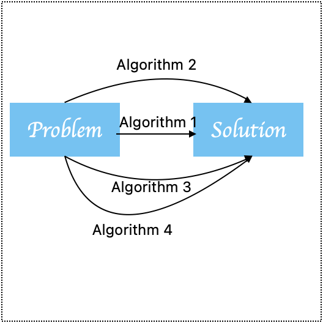
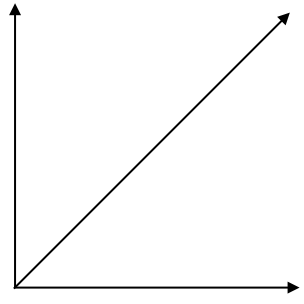
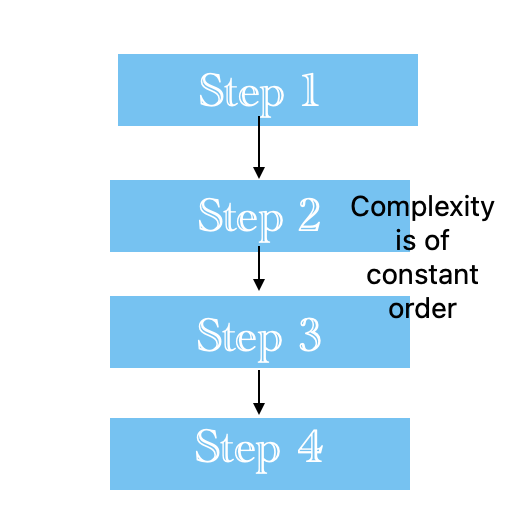
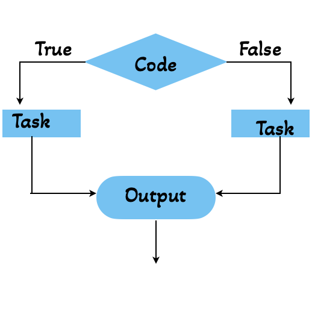
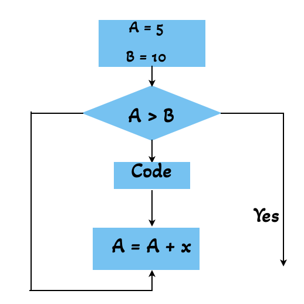

# Computational requirements for Algorithm

- Algorithms are a finite set of well- defined instructions ti solve a particular problem characteristics <br>
1. I/O
2. Fintiness
3. Feasibility
4. Unambiguous



## Time Complexity
This quantifies the amount of a time required to run as algorithm to its competion as a function of input size.<br>
Time complexity can be defined as a numberical function F(n),where F(n) is measured as the number of steps,provided all steps consuming the same time <br>
suppose, adding of two bits take c secounts<br>
Then adding n bits will take n.c seconds<br>
So, F(n) = n.c <br>
Therefore F(n) is linarly proportional to the input size.<br>



## Space Complexity
The space required by an algorithm in its complete life cycle is called space complexity.The required meaning space has two parts.<br>
1. Fixed part :- The space required for data storing , data definition , definition a variable
2. Variable part :- The space required for storing variable that are depented on size of the problem , for example dynamic memory allocation ,recursion , stack space.

## Big $O$ notation
'O' defines the relationship between the input and step taken by the algorithm.

Some example of complexity
```python
def complexity(list):
    output = list[1]*list[2]*list[3]
    print(output)
complexity([1,2,3,4,5,6,7])
```

```python
def complexity(list):
    for i in list:
        print(i)
complexity([1,2,3,4])
```

A,B are n $\times$ 3 Matrix
```python
import numpy
def add(M1,M2):
    M3 = numpy.zeros(n,n)
    for i in range (n):
        for j in range (n):
            M3[i][j] = M1[i][j] + M2[i][j]
    return M3
M1=[[1,0],[0,1]]
M2=[[0,1],[1,0]]
print(add(M1,M2))
```
Complexity of a complex function

```python
def Complex_func(list):
    count = 0
    for i in range(6):
        count += 1
        print(count)
    for j in list:
        count += 1
        print(count)
    for k in list:
        count += 1
        print(count)
Complex_func([1,2,3,4])
```

$O(6)+O(n)+O(n) \\
= O(2n+6)<br>$
if n >> 6 <br>
then $O(2n)$

## Complexity through logic control structure
1. Sequential flow



2. Selectional flow



Complexity $O(n)$

3. Repetitive flow




```python
Fruits = ["Apple", "Banana", "Mango"]
Adjective = ["Tasty","Juicy","Fresh"]
for y in Adjective:
    for x in Fruits:
        print(y,x)
```

$O(m,n)$<br>
where m = len[Adjective]<br>
n = len[Fruit]<br>

## Complexity of common search of Algorithm
### Linear Search
```python
def lin_search(list,target):
    for i in range(len(list)):
        if list[i] == target:
            return i
        else:
            return False
print(lin_search([4,19,25,26,29], 4))
```
Best case : i = 0 , $O(1)$<br>
Worst case : $O(n)$<br>
Average case : $O(\frac{n+1}{2})$

### Binary search
```python
def bin_search(list,l,r,target):
    if r >= l:
        mid = l + (r - l) // 2
        if list[mid] == target:
            return mid
        elif list[mid] > target:
            return bin_search(list, l, mid - 1, target)
        else:
            return bin_search(list, mid + 1, r, target)
    else:
        return False

print(bin_search([10,20,30,40,50], 0, 4, 40))
```
