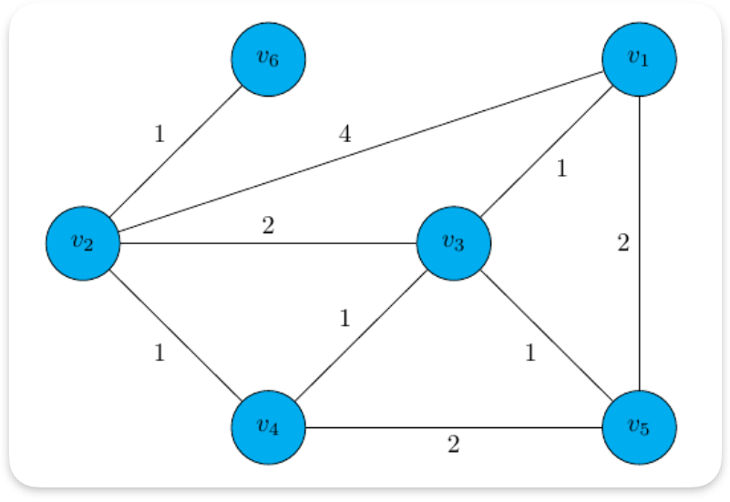

# Graph Theory
## Graph:
- A graph is an abstract representation of some object and Connection between these objects.The objects are called vertices and the connection between two vertices are called edges. 
Formally a graph can be written as: 
$G = (V,E)$ 
where V is the given vertices set E is the edge set. 
Given that :$V = \{V_1,V_2,V_3,V_4,V_5,V_6\}\rightarrow$ indirect graph 

$E = \{e_{12},e_{13},e_{15},e_{23},e_{24},e_{26},e_{34},e_{35},e_{45}\}$ 
$E = \{e_{12},e_{15},e_{26},e_{24},e_{32},e_{34},e_{35},e_{45},e_{31}\}\rightarrow$ direct graph 

## Path:
- A path is a sequence of vertices where each consective pair of vertices has an edge between them. 
$V = \{V_1,V_2,V_3,V_4,V_5,V_6\}$ 
$\{V_2,V_3,V_5,V_1\}$

## Cycle
- A cycle is a path when starting and ending vertices are same. 

## Tree or acyclic graph:
- A tree or acyclic graph is a graph G = (V,E) that has no cycle. 
- MST - Minimum spanning tree.

## Connection graph:
- A connection graph is called connected if there is a path between every pair of vertices. 
- If not, it is a disconnected graph. 

## Components
- A component is a maximal set of connected vertices. Each component is a connected
subgraph.

## Adjacency Matrix:
- An adjacency matrix is a square matrix representing vertices and edge connection this vertices. 

$A[i][j] = \begin{cases}
1 & \text{if (i,j) are connected with an edge} \\
0 & \text{else}
\end{cases}$ 

Directional Matrix

|     |$V_1$|$V_2$|$V_3$|$V_4$|$V_5$|$V_6$|
|-----|-----|-----|-----|-----|-----|-----|
|$V_1$|  0  |  1  |  1  |  0  |  1  |  0  |
|$V_2$|  1  |  0  |  1  |  1  |  0  |  1  |
|$V_3$|  1  |  1  |  0  |  0  |  1  |  0  |
|$V_4$|  0  |  1  |  0  |  0  |  1  |  0  |
|$V_5$|  1  |  0  |  1  |  1  |  0  |  0  |
|$V_6$|  0  |  1  |  0  |  0  |  0  |  0  |

unidirectional graph symmetric matrix

## Weight Matrix / Network
Weight graph  
With directional network 

|     |$V_1$|$V_2$|$V_3$|$V_4$|$V_5$|$V_6$|
|-----|-----|-----|-----|-----|-----|-----|
|$V_1$|  0  |  4  |  1  |  0  |  8  |  0  |
|$V_2$|  4  |  0  |  2  |  1  |  0  |  1  |
|$V_3$|  1  |  2  |  0  |  0  |  1  |  0  |
|$V_4$|  0  |  1  |  0  |  0  |  2  |  0  |
|$V_5$|  2  |  0  |  1  |  2  |  0  |  0  |
|$V_6$|  0  |  1  |  0  |  0  |  0  |  0  |

## Degree
- The number of edges incident on a vertex. 
$d(v_1) = 3 \\
d(v_2) = 4 \\
d(v_3) = 2 \\
d(v_4) = 3 \\
d(v_5) = 3 \\
d(v_6) = 1$

$$\sum_{i = 1}^6 = 16 =2 \times 8 $$

<!-- fig -->
The sum of degree of all vertices of a graph is equivalent to twice the number of edges.
- Undirected Graph: Degree = number of connected edges. 

- Directed Graph: 
 In-degree: Number of incoming edges. 
 Out-degree: Number of outgoing edges. 

- A is an adjecency matrix indirect graph 
$$
\begin{bmatrix}
& V_1 & V_2 & V_3 & V_4 & V_5 \\
V_1 & 0 & 1 & 0 & 1 & 1\\
V_2 & 1 & 0 & 1 & 0 & 0\\
V_3 & 0 & 1 & 0 & 1 & 1\\
V_4 & 1 & 0 & 1 & 0 & 1\\
V_5 & 1 & 0 & 1 & 1 & 0\\
\end{bmatrix}
$$

<!-- photo -->

## Dijkstra's Algorithm

<!-- PHOTO -->
|Visited                 |Unvisited                |
|------------------------|-------------------------|
|$V_1,V_3,V_4,V_5,V_2,V_6$|$V_1,V_2,V_3,V_4,V_5,V_6$|

|Vertex|Shortest distance|previous vertex |
|------|-----------------|----------------|
|$V_1$ |    0            |        -       |
|$V_2$ |  1 + 2 = 3      |       V_3      |
|$V_3$ |    1            |       V_1      |
|$V_4$ |    2            |       V_3      |
|$V_5$ |    2            |       V_1      |
|$V_6$ |    5            |       V_2      |

<!-- PHOTO -->
|Visited                 |Unvisited                |
|------------------------|-------------------------|
|$V_1,V_2,V_4,V_3,V_5$|${\not V_1,\not V_2,\not V_3,\not V_4,\not V_5}$|

|Vertex|Shortest distance|previous vertex |
|------|-----------------|----------------|
|$V_1$ |    0            |        -       |
|$V_2$ |    1            |      $V_1$     |
|$V_3$ |    5            |      $V_2$     |
|$V_4$ |    4            |      $V_2$     |
|$V_5$ |    6            |      $V_2$     |

